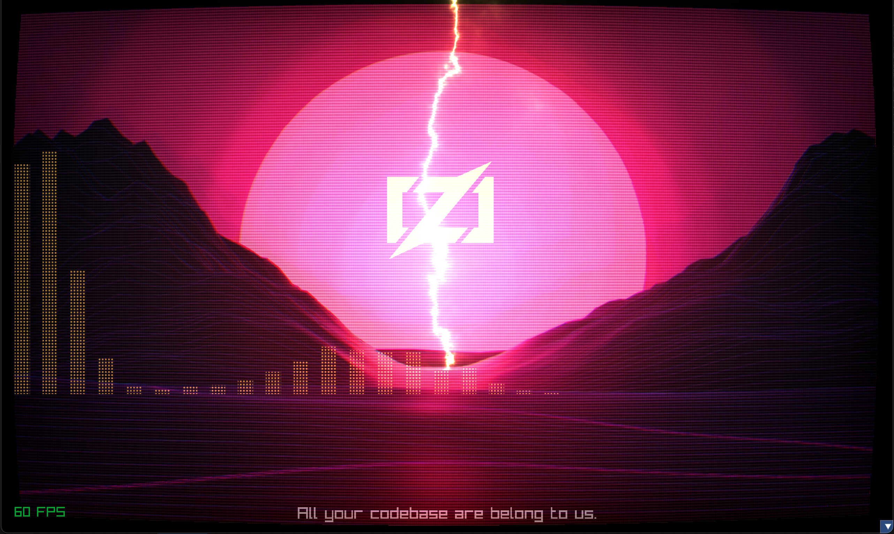

# zig-notebook
A repository to mess around in the Zig language - try things out, record notes, etc.

## List of Projects
Built and test on Zig 0.12 on MacOS. 
Please send patch if you'd like to see this working on another platform!

### Zig Patterns
  * Comptime Interfaces
  * Foo
  * Bar

### ShaderGui

This demo shows off Raylib 5.0, GLSL 330 shaders, and a Zig implementation of the Fast Fourier Transform (FFT).



#### Features
  * GLSL 330 - lightening, led matrix shaders
  * Sweet music visualizing thanks to the FFT algorithm implemented in Zig
  * Thunder and static electricity sound
  * Prototype of hot-swappable shader at runtime.

#### Requires
  * MacOS implementation for now, probably won't compile on Windows or Linux until someone sends me a patch!
  * Raylib 5.0
  * A video card supporting GLSL 330 - shaders must be ported to older style (for older video cards) which I have not done.

```sh
# Navigate to: shaders/shadergui
zig build run
```